# Milestone project 2: Building a memory game: COD Zombies perks edition

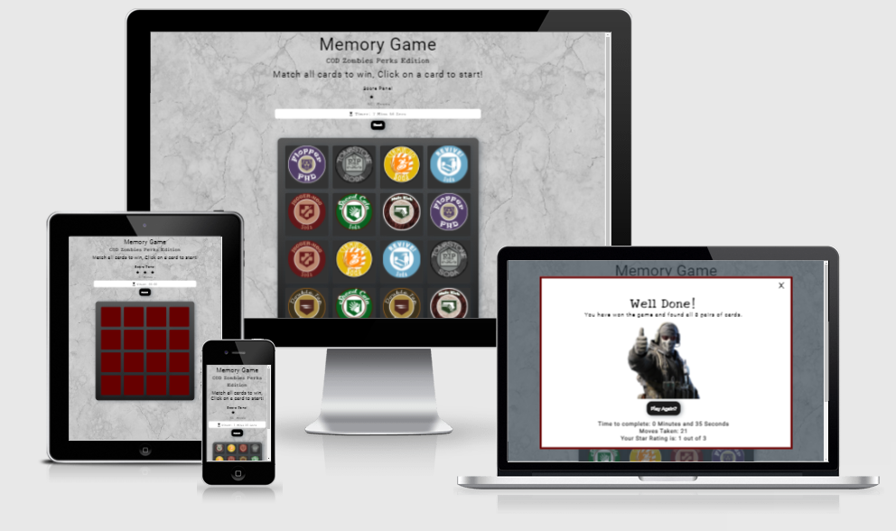

[Link to Live Website](https://adilkhr.github.io/my-ms2-project/)

[GitHub Repo](https://github.com/adilkhr/my-ms2-project)

***

## The purpose of the project

* To create an easy and responsive memory game based on the game call of duty zombies using HTML, CSS and Javascript for users to engage and test themselves to see how good their memory is so that they can improve further by replaying again.

***

## User Experience (UX)

## Strategy

### User stories

#### First time visitor goals:

As a new user:

* I want to easily understand what type of game it is that I am playing and what the aim of the game is

* I want a game that is fully functional alongside being responsive on any device

* I want to be presented with a positive message once i complete the game alongside with the progress of how i did

* I want to have the option to play again once i finish

#### Visiting User goals:

* I want to have the option to play again once i finish

* I want to see how long it takes me to complete the game so that i can keep improving my speed and memory

* I want to know what my score rating is so that i can aim to get the highest score rating possible

* I want to restart my current game if i am currnetly not happy with it

* I want a game that is fully functional alongside being responsive on any device

#### Reasons for the website:

* To allow players to test their memory

* To showcase work

* To bring in call of duty zombies gamers to try something fun thats related to the game they play

* To create a game that i would enjoy playing myself

***

## Scope

#### What a user may expect:

* Easy to navigate website

* A game that is visually appealing on all devices

* Links and functions/buttons working as expected

* A game that is fair and simple for all ages 

* A game that is fun to play

#### What a user may want:

* A timer to show how long it takes them to complete the game

* Clear instructions of the game and what the aim of the game is

* A reset button to reset the game to start again if they are not happy with their current progress

* A score panel indicating how well they are doing

* A message to congratulate them once they complete the game showing them their time taken to complete aswell as their score rating

* An option to play again once completed

#### As a developer / business I expect:

* To provide a clear objective of the game to users

* To create a responsive card panel that functions when users click on them

* To create a timer that starts counting once the player clicks on a card to begin

* To create a game that is responsive on all devices with no bugs

* To ensure that the game is playable and fun for all ages allowing users to play and then replay the game

***

## Structure

The site will consist of 1 main page which will have all the information provided on the main page such as the name of the game, the aim of the game, a score panel and a timer alongside with a reset button which will reset the current game being played by the user, and of course the card pannel containing 16 cards with 8 images including their respective pair. Once the user completes the game, they are provided with a well done message and a thumbs up image with feedback of the time taken to complete aswell as their score rating, it will also provide the user an option to play again with a play again button.

## Features

* A clear title of the game aswell as a clear instruction of what the aim of the game is

* A score pannel of how well they are doing during the progression of the game aswell as a move counter to show how many moves they are using

* A timer when the player begins the game so they are aware of how long it takes them to complete aswell as a reset button if the user feels they want to restart the game

* The game will include 16 cards with a pair for each 8 images included in the game for the player to match, if the player gets an incorrect match then the cards flip over, but if they get a correct match, an animation appears and the images stay visible making it easier for the players to match other pairs further on during the game

* The player will be presented a well done message once they complete the game with feedback of how they did interms of time and moves used which will generate a score, the player will also be given an option to play again through clicking a play again button

***

## Future Features

* A future feature that I would like to add is probably some sort of leaderboard with the best times taken to complete the game aswell as amount of moves taken, that way players will feel more motivated to play and carry on to compete for the top spot

* Another future feature that I would like to implement is different types of games to the site (not just a memory game) so that if the user feels they want a differnt game to play they have the option there, to keep them more engaged with the site

* Another future feature that would be a good feature is to apply a countdown timer when the user starts the game as this would apply the user a slight sense of pressure to complete the game before the countdown ends making them feel more engaged into the game

***

## Skeleton

### Wireframes:

* You can view the dekstop wireframe for the memory game [here](https://github.com/adilkhr/my-ms2-project/blob/master/wireframes/wireframesforms2desktop.pdf)

* You can view the mobile wireframe for the memory game [here](https://github.com/adilkhr/my-ms2-project/blob/master/wireframes/wireframesforms2mobile.pdf)

### Mockup:

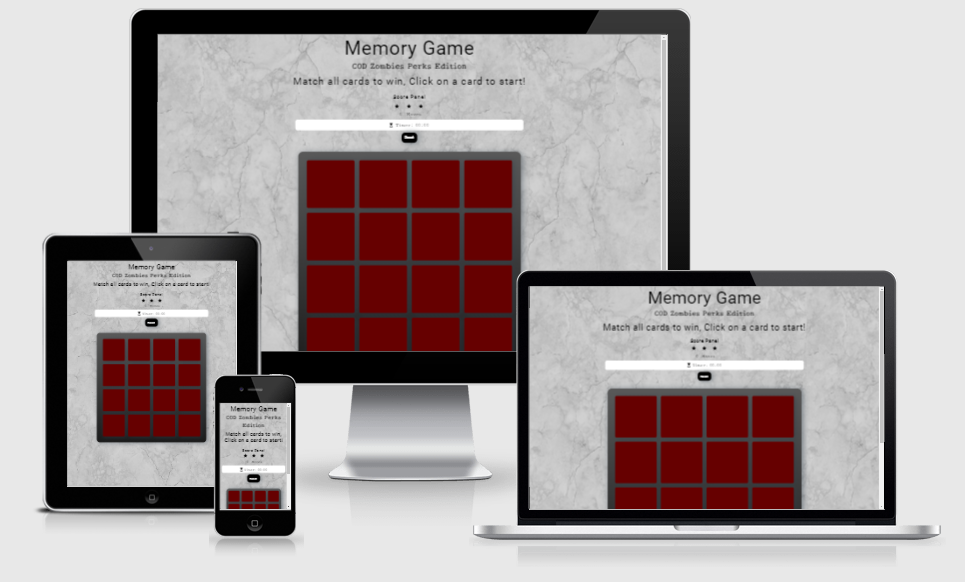

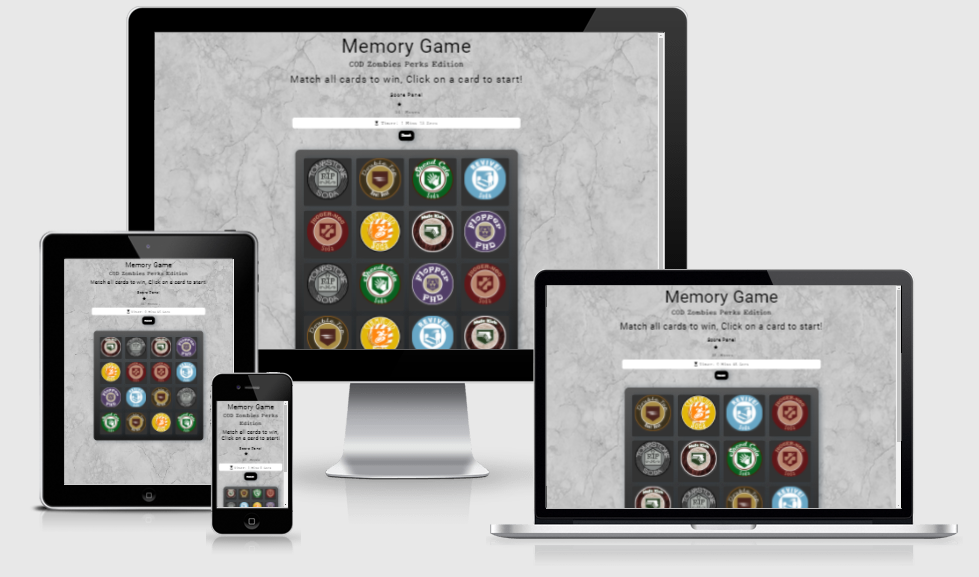

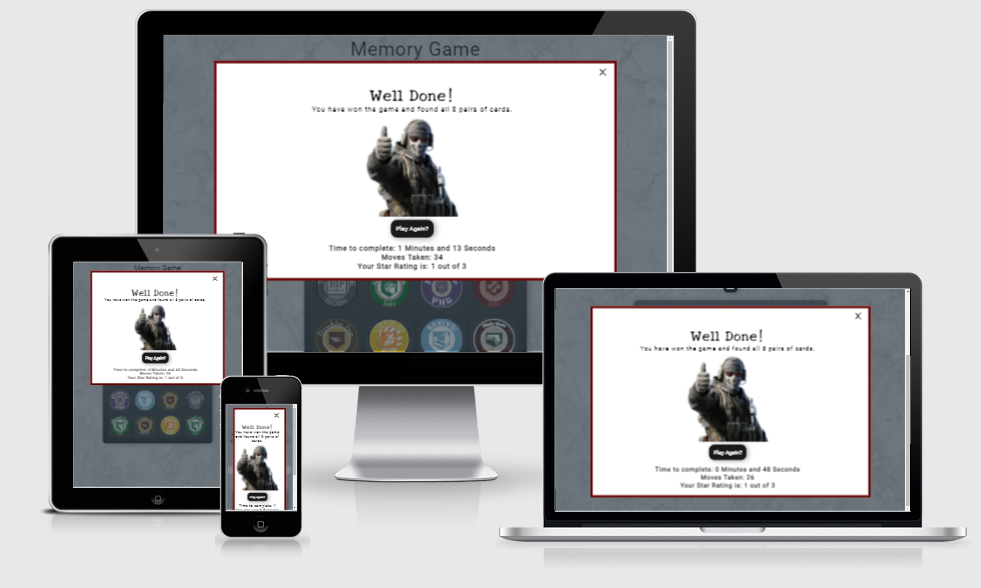

***

## Typography and color scheme

* The theme of the game was actually taken from a game I enjoy myself which is from call of duty and their zombies game mode so I thought of a way to implement the theme into the game through the use of relevant images of the game aswell as a specific color scheme

* The three main colours involved with my project are black, grey and red, as my game is based on a zombie themed game from call of duty which i am aware people are familiar with so I have added the color red to the cards but inside a grey box, with a light grey background and black text

* The fonts used were from google fonts with the font familys roboto and new tegomin as I feel the new tegomin font style fits very well for the zombie theme approach of the game and the roboto balances it out so that the games font and text in general doesnt look to takky at all

* All images used for the game was taken from google search as I needed the specific images related to the theme of the game

***

## Technology

### Languages & Frameworks

* HTML5 - Mark-up language used to create the pages for site using semantic structure
* CCS3 - Cascading style sheet used to style the site, aswell as adding media queries to make it responsive for pretty much all devices
* Javascript - Programming language used to create functions working for the site
* [Gitpod.io](https://www.gitpod.io/) - Used for creating the workspace for writing the code. Using the command line terminal for commiting and pushing to GIT Hub
* [GitHub](https://github.com/) - Used for hosting repositories
* GIT - Used for pushing the code to repositories

### Front End

* [Google fonts](https://fonts.google.com/) - Used for the Font
* [Font Awesome](https://fontawesome.com/) - For the icons used

### Planning

* [Balsamic Wireframes](https://balsamiq.com/) - Used to create the wireframe designs of the site
* [Iamresponsive](http://ami.responsivedesign.is/) - Used for mockup images

***

## Testing

### Supported screens:

With the use of CSS media queries styles, using the google chrome inspect tool, I was able to see that my site is supported for all screens with a width of 280px. I did some testing by sending my website link to my friends and familys devices and they had seen no issues.

### Supported browsers:

The website link has been tested on Google chrome, Internet Explorer and Microsoft edge, Brave and Firefox.

### OS compatibility:

Tested on iOS, Android 10, and Windows 10. - I asked a friend with an Adroid to test that it was working. Tested for responsiveness using Chrome DevTools.

### Peformance Testing:

Tested on the Developer Tools Lighthouse.

### Code validation:

* When completing my HTML code, I had then inputed the code through [w3schools validator](https://validator.w3.org/) and found that there was no errors in the code

* When completing my CSS code, I had then inputed the code through [w3schools validator](https://validator.w3.org/) and selected the CSS option and found that again just like the HTML code there was no errors in the code

* When completing my Javascript code, I had then inputed the code through the [Javascript validator (JS hint)](https://jshint.com/) to ensure there was no erros in the Javascript code, it turns out there was no errors in the code

### Test User Stories

### First time users

* #### I want to easily understand what type of game it is that I am playing and what the aim of the game is

The name of the game is presented at the top of the page along with clear instuction on how to start and play
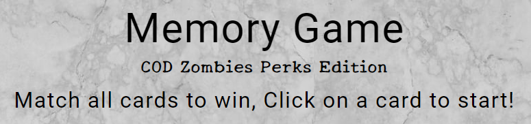

* #### I want to be presented with a positive message once i complete the game alongside with the progress of how i did

Once the user matches all cards, they are presented with a well done message telling them they have found all 8 pairs of cards with a thumbs up image, they are also provided with the time taken to complete along with the moves taken to complete which then provides them with their star rating
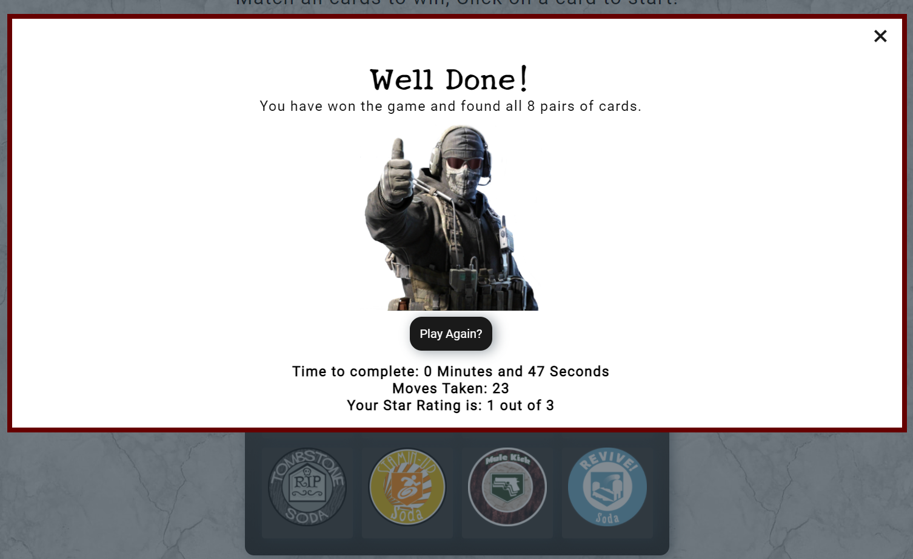

### Visting Users

* #### I want to see how long it takes me to complete the game so that i can keep improving my speed and memory

A timer is presented on screen that starts counting up once the user clicks on a card
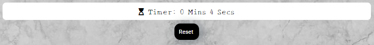

* #### I want to know what my score rating is so that i can aim to get the highest score rating possible

A score panel is presented above the timer for users to see how well they are doing aswell as the amount of moves used

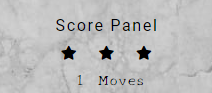

* #### I want to restart my current game if i am currently not happy with it

There is a reset button presented above the card panel for users to click allowing them to start fresh which will reset the cards positions, the timer and the score panel along with the amount of moves used
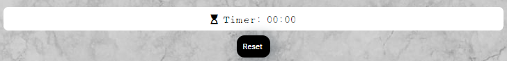

### All Users

* #### I want a game that is fully functional alongside being responsive on any device

By using css media queries, the game is responsive and playable across all devices alongside with all buttons and functions working

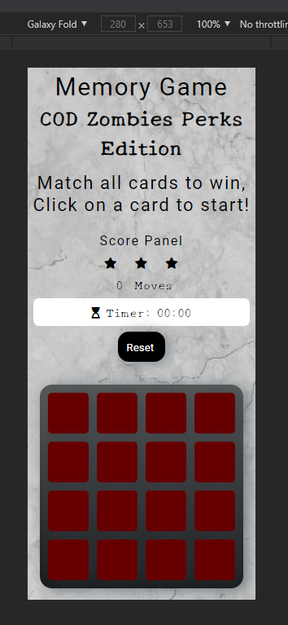

* #### I want to have the option to play again once i finish

Once the user finishes the game and is presented with the well done message, there is a play again button which will allow users to play again
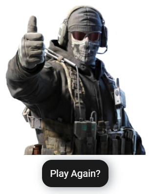

### Fixed Bugs:

* A major bug I was experiencing when creating my project was that my game was not responsive for a lot of smaller screen devices such as the galaxy fold, so I then added some media queries to adjust the sizing issue of the card deck pannel for screens that had small widths

* Another bug I was experiencing was when viewing the page through the python3 -mhttp.server comand in the terminal, the site was not showing as this is because I realised I had called the html file game.html, which I then changed it to index.html so that it views properly

***

## Deployment

### Github pages:

The deployment process of my project was done using the following steps:

1. Log in to GitHub and locate the GitHub Repository of the project currently working on.

2. At the top of the Repository (not top of page), locate the "Settings" Button on the menu.

3. Scroll down the Settings page until you locate the "GitHub Pages" Section.

4. Under "Source", click the dropdown called "None" and select "Master Branch".

5. The page will automatically refresh.

6. Scroll back down through the page to locate the now published site link in the "GitHub Pages" section.

### Forking the GitHub Repository:

By forking the GitHub Repository you will be able to make a copy of the original repository on your own GitHub account allowing you to view and/or make changes without affecting the original repository by using the following steps:

1. Log in to GitHub and locate the [GitHub Repository](https://github.com/)
2. At the top of the Repository (not top of page) just above the "Settings" Button on the menu, locate the "Fork" Button.
3. You should now have a copy of the original repository in your GitHub account.

### Making a Local Clone

1. Log in to GitHub and locate the [GitHub Repository](https://github.com/)
2. Under the repository name, click "Clone or download".
3. To clone the repository using HTTPS, under "Clone with HTTPS", copy the link.
4. Open Git Bash
5. Change the current working directory to the location where you want the cloned directory to be made.
6. Type `git clone`, and then paste the URL you copied in Step 3.

```
$ git clone https://github.com/YOUR-USERNAME/YOUR-REPOSITORY
```

7. Press Enter. Your local clone will be created.

```
$ git clone https://github.com/YOUR-USERNAME/YOUR-REPOSITORY
> Cloning into `CI-Clone`...
> remote: Counting objects: 10, done.
> remote: Compressing objects: 100% (8/8), done.
> remove: Total 10 (delta 1), reused 10 (delta 1)
> Unpacking objects: 100% (10/10), done.
```

***

## Credits

### Media:

* All images used were taken from [google images](https://www.google.com/imghp?hl=en)

### Acknowledgements:

* Rohit Sharma (mentor support) - Provided me with help on how to structure the site and what should be the main focuses of the project

* Matt Rudge - Template for Gitpod.io

* Full Stack Developers WhatsApp group (members of the codeinstitute slack community) - for taking the time to test the website aswell as providing help when needed with issues

* I had used the [Code institute sample read me template](https://github.com/Code-Institute-Solutions/SampleREADME) to structure my own readme

* Slack provided me with a lot of help and information when needed

* The [w3schools](https://www.w3schools.com/js/DEFAULT.asp) provided me with a lot of help and understanding with javascript when I had some uncertainty to it

* Although CI tutor support werent able to resolve my issue that I had with responsiveness due to me being unavailable when they had contacted me, I was able to resolve the issue myself but they were very friendly and supoortive with troubleshooting

### Content:

Code & Content (not already attributed): Adil Khair

### Inspiration:

* Youtube provided me with alot of understanding and help on how to build my game and how to function it with javascript to recieve a better understanding on how to build a memory game as I found these videos very useful, (https://www.youtube.com/watch?v=bbb9dZotsOc) (https://www.youtube.com/watch?v=ZniVgo8U7ek)